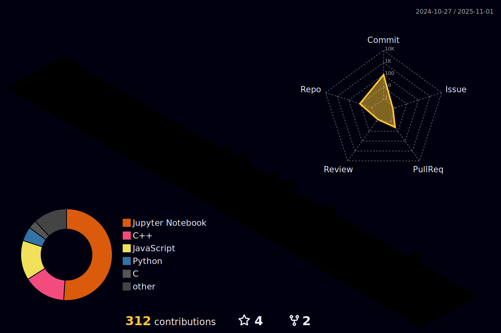

<!-- Hi there 👋 -->
<h1 align="center">Hi, I'm Sarah 👩‍💻</h1>

  Passionate about software development, machine learning, and building cool things! 

---

### 📊 My GitHub Contribution Landscape

  

---

### 🚀 About Me

- 🌱 I’m a pre-final year student at IIT Jodhpur, majoring in Electrical Engineering! My passion resonates with the technological landscape!
- 💬 Currently working on Fullstack development and Parallel Computing! 
- 📫 How to reach me: [LinkedIn]([https://linkedin.com/in/sarahfatima12](https://www.linkedin.com/in/sarahfatima12/)) 

---

### 🧰 Tools & Technologies

  
  
  
  
  
  
  
  
  
  
  
  

---

### 📈 GitHub Stats

  

>

---

---

Thanks for visiting! 😊

