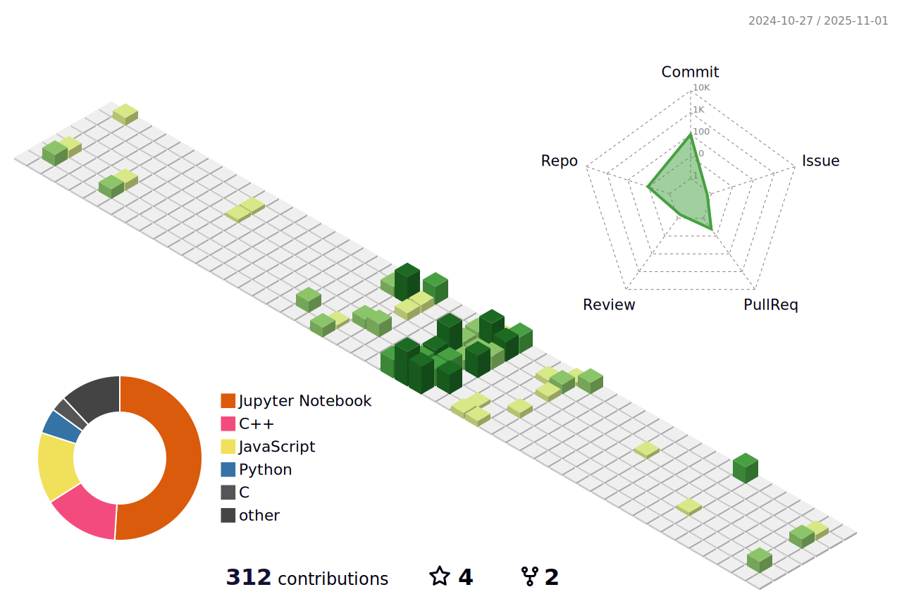

<!-- Hi there 👋 -->
<h1 align="center">Hi, I'm Sarah 👩‍💻</h1>

  Passionate about software development, machine learning, and building cool things! 

---

### 📊 My GitHub Contribution Landscape

  

---

### 🚀 About Me

- 🌱 I’m currently a sophomore at IIT Jodhpur, majoring in Electrical Engineering! My passion resonates with the technological landscape!
- 💬 Ask me about anything tech-related!
- 📫 How to reach me: [LinkedIn]([https://linkedin.com/in/YOURUSERNAME](https://www.linkedin.com/in/sarahfatima12/)) 
- ⚡ Fun fact: I love exploring things which boost my learnings!

---

### 🧰 Tools & Technologies

  
  
  
  
  

---

### 📈 GitHub Stats

  
  

---

---

Thanks for visiting! 😊

